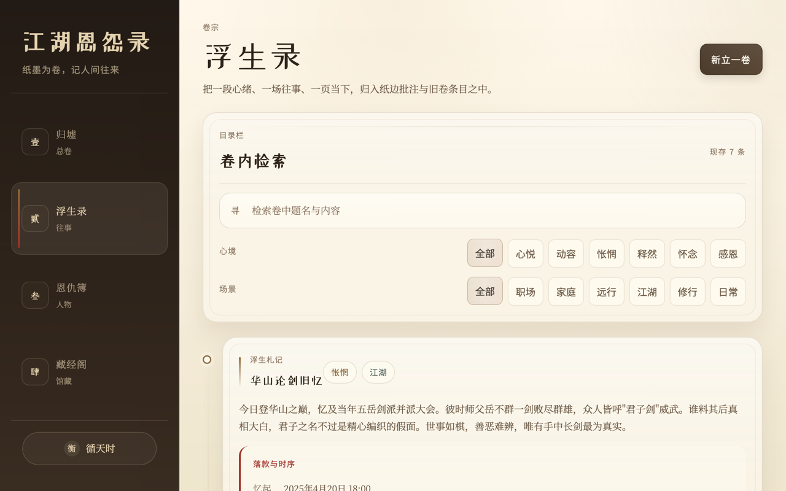
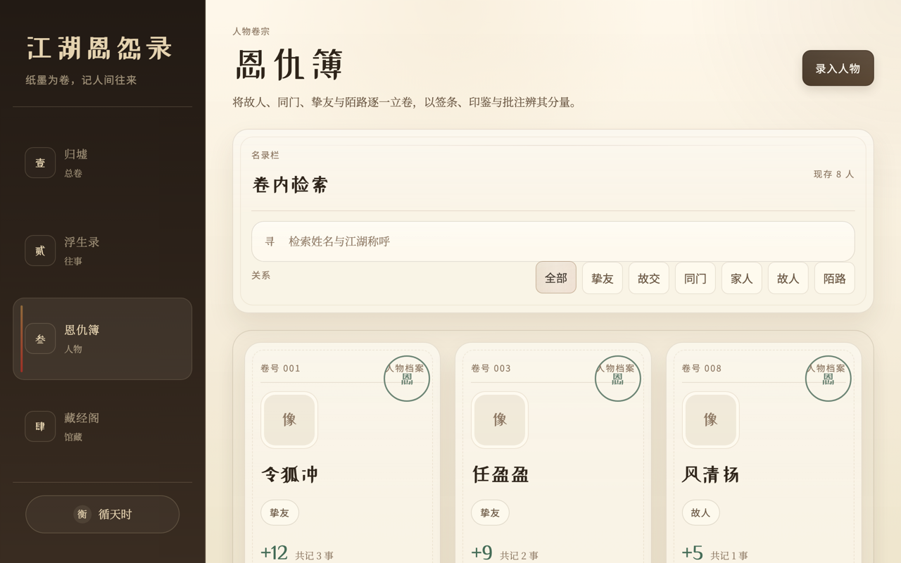
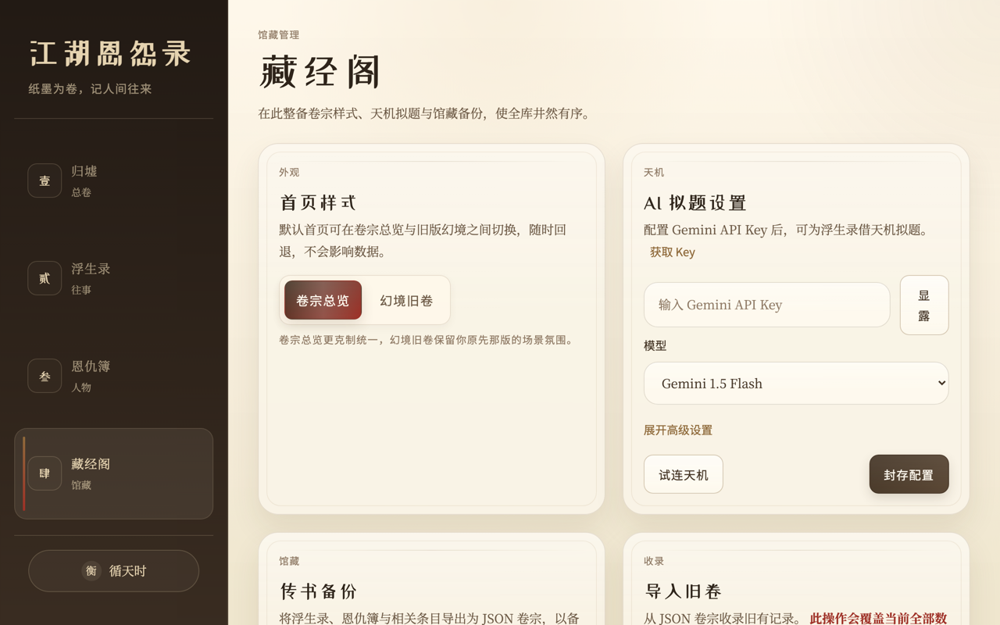
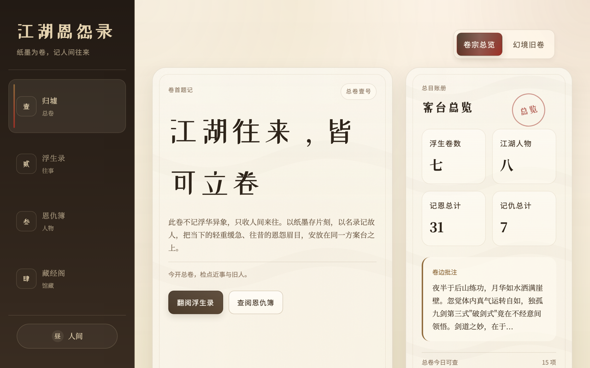
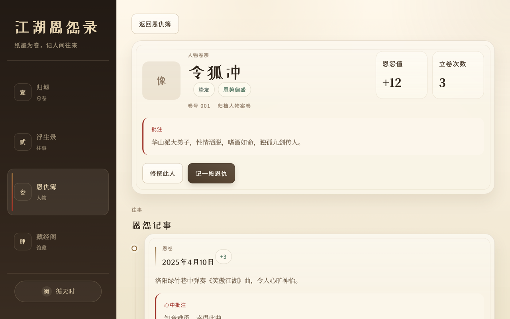

<p align="center">
  
</p>

<h1 align="center">江湖恩怨录</h1>

<p align="center"><em>纸墨为卷，记人间往来</em></p>

<p align="center">
  
  
  
  
  
</p>

<p align="center">
  一款融合仙侠古典美学的<strong>本地优先</strong>个人记事应用。<br/>
  日记叫做「浮生录」，通讯录叫做「恩仇簿」，保存叫做「落笔」，删除叫做「焚毁」。<br/>
  用武侠世界的语言，记录你真实生活中的珍贵片刻与人际往来。
</p>

<p align="center">
  <strong>所有数据存储在本地，不会上传到任何服务器。</strong>
</p>

---

## 界面预览

### 亮色主题 · 人间

<table>
  <tr>
    <td align="center">
      <br/>
      <sub><b>归墟（首页）</b></sub>
    </td>
    <td align="center">
      <br/>
      <sub><b>浮生录（日记）</b></sub>
    </td>
  </tr>
  <tr>
    <td align="center">
      <br/>
      <sub><b>恩仇簿（人物档案）</b></sub>
    </td>
    <td align="center">
      <br/>
      <sub><b>藏经阁（设置）</b></sub>
    </td>
  </tr>
</table>

### 暗色主题 · 幽都

<table>
  <tr>
    <td align="center">
      <br/>
      <sub><b>归墟（首页）· 幽都</b></sub>
    </td>
    <td align="center">
      <br/>
      <sub><b>人物详情 · 恩怨时间线</b></sub>
    </td>
  </tr>
</table>

---

## 核心功能

### 📜 浮生录 — 生活瞬间记录

把一段心绪、一场往事、一页当下，归入纸边批注与旧卷条目之中。

每条札记包含标题、正文、**心境**（心悦 / 动容 / 怅惘 / 释然 / 怀念 / 感恩）和**场景**（职场 / 家庭 / 远行 / 江湖 / 修行 / 日常），支持「当此感怀」（实时记录）与「追忆往昔」（回忆录）两种模式，并以时间线形式展示。支持按标题内容搜索、按心境和场景筛选。

### 📖 恩仇簿 — 人际关系档案

将故人、同门、挚友与陌路逐一立卷，以签条、印鉴与批注辨其分量。

为每位人物建立卷宗，记录姓名、关系类型（挚友 / 故交 / 同门 / 家人 / 故人 / 陌路）、头像和备注。系统自动汇总每人的「恩怨值」，并根据阈值在卡片上盖上「恩」「仇」「至善」「极恶」的印鉴。

### ⚖️ 恩怨事件系统

在人物详情页记录具体的恩卷 / 仇录事件，每件事包含类型、程度（1–5 级）、日期、详情和个人感受。恩情加分、仇怨减分，正负相加即为该人物的恩怨值。

### ✨ AI 拟题 — 借天机生成古风标题

集成 Google Gemini API，写完浮生录后点击「借天机拟题」，即可获得一个古典雅致的标题——四字成语、五七言诗句或章回体回目皆可。未配置 API Key 时自动降级为内置规则引擎（关键词匹配 + 模板拼接），确保任何环境下都能使用。

### 🌓 双主题系统

三档切换：**人间**（亮色宣纸质感）、**幽都**（暗色古铜氛围）、**循天时**（跟随系统偏好），在侧边栏底部一键循环切换。两套主题均经过精心调校，覆盖 50+ CSS 自定义属性。

### 🏠 首页双模式

- **卷宗总览**：信息密集的仪表盘，展示统计概览、最近札记和关系异动
- **幻境旧卷**：全屏沉浸式仙侠场景，带有纯 CSS 四季粒子动画（春天樱花飘落、夏天萤火虫闪烁、秋天红叶翻飞、冬天透视落雪），以及跟随鼠标的水墨涟漪效果

### 💾 数据导入导出

进入藏经阁即可一键「传书」（导出全部数据为 JSON）或「收录」（从 JSON 导入），用于备份和跨设备迁移。

---

## 技术栈

| 层面 | 技术 |
|:---|:---|
| 前端框架 | React 19 + React Router 7 |
| 构建工具 | Vite 7 |
| 数据存储（Web） | IndexedDB（via `idb`） |
| 数据存储（桌面） | SQLite（via `better-sqlite3`） |
| 桌面端 | Electron 40 |
| AI 集成 | Google Gemini API（`@google/generative-ai`） |
| UI 方案 | 纯手写 CSS，无 UI 框架，三套 Google Fonts |
| 代码规范 | ESLint 9（flat config） |

---

## 快速开始

### 系统要求

Node.js 18+（推荐 20+），Windows / macOS / Linux 均可。

### Web 版本

```bash
# 克隆仓库
git clone https://github.com/1yangliwen/jianghu-journal.git
cd jianghu-journal

# 安装依赖
npm install

# 启动开发服务器
npm run dev
```

打开终端提示的地址（默认 `http://localhost:5173`）即可使用。

### 构建生产版本

```bash
npm run build
npm run preview
```

### Electron 桌面端（可选）

```bash
# 开发模式（同时启动 Vite + Electron）
npm run electron:dev

# 打包
npm run electron:build
```

> **注意**：桌面端使用本地 SQLite 数据库存储，数据库文件位于系统用户数据目录下（`xianxia-journal.db`）。当前 `electron/main.js` 依赖 `better-sqlite3`，如需使用桌面端请先手动安装该依赖并确保原生模块可在本机构建。

### AI 拟题配置（可选）

1. 前往 [Google AI Studio](https://aistudio.google.com/apikey) 获取 Gemini API Key
2. 在应用内进入「藏经阁」→「AI 拟题设置」，填入 Key 并选择模型
3. 点击「试连天机」验证连通性，成功后点击「封存配置」保存
4. 如需通过代理访问，可展开「高级设置」配置自定义 Base URL 或本地代理地址

---

## 项目结构

```
jianghu-journal/
├── electron/              # Electron 主进程与 preload
│   ├── main.js            # 主进程（SQLite + IPC + AI 代理）
│   └── preload.js         # 安全桥接（contextIsolation）
├── public/                # 静态资源
├── src/
│   ├── components/        # 业务组件
│   │   ├── Layout.jsx     # 整体布局（侧边栏 + 内容区）
│   │   ├── Sidebar.jsx    # 侧边栏导航
│   │   ├── MomentCard.jsx # 浮生录卡片
│   │   ├── MomentForm.jsx # 浮生录表单
│   │   ├── PersonForm.jsx # 人物表单
│   │   ├── EventForm.jsx  # 恩怨事件表单
│   │   └── ThemeToggle.jsx# 主题切换
│   ├── pages/             # 页面
│   │   ├── Home.jsx       # 归墟（首页，双模式）
│   │   ├── Moments.jsx    # 浮生录
│   │   ├── Grudges.jsx    # 恩仇簿
│   │   ├── PersonDetail.jsx # 人物详情 + 恩怨时间线
│   │   └── Settings.jsx   # 藏经阁
│   ├── contexts/
│   │   └── ThemeContext.jsx# 主题 + 首页模式管理
│   ├── services/
│   │   └── aiService.js   # Gemini API 集成
│   ├── utils/
│   │   └── titleGenerator.js # 规则引擎标题生成（AI 降级方案）
│   ├── styles/
│   │   └── seasons.css    # 四季粒子动画样式
│   ├── db.js              # 数据层（IndexedDB / SQLite 双轨）
│   ├── App.jsx            # 路由配置
│   ├── App.css            # 全局样式
│   └── index.css          # 基础样式 + 设计令牌
├── docs/screenshots/      # 截图资源
├── package.json
├── vite.config.js
└── eslint.config.js
```

---

## 设计亮点

**沉浸式武侠 UI 语言**：所有按钮、标签、提示文案均经过武侠化处理——「保存」→「落笔」，「取消」→「罢了」，「删除」→「焚毁」，搜索框前缀是「寻」字，营造出翻阅古卷的沉浸感。

**精心制作的动画系统**：卷宗展开带 3D 透视翻转、印鉴盖章带弹性回弹、交错入场动画、纸张光泽扫过效果、水墨波纹等，同时适配了 `prefers-reduced-motion` 媒体查询，对动效敏感用户优雅降级。

**四季粒子系统**：幻境首页用纯 CSS 实现了四季动画——30 片樱花瓣、20 只萤火虫、25 片枫叶、40 片雪花，无 Canvas 无 JS 动画库，根据当前月份自动切换季节。

**双存储架构**：同一套前端代码通过 `window.electronAPI` 的存在性检测，无缝切换 Web（IndexedDB）和桌面端（SQLite），无需条件编译。

**恩怨量化体系**：将人际关系数值化，每件恩仇事件都有 1–5 级程度评分，正负相加得出「恩怨值」，根据阈值自动盖上对应印鉴，让人际关系一目了然。

---

## 使用建议

1. 在「浮生录」随时记录当下的片刻感怀，按心境和场景分类回看
2. 在「恩仇簿」为生活中的重要人物建立卷宗，在人物详情中记录具体恩仇事件
3. 定期在「藏经阁」执行「传书备份」，导出 JSON 文件妥善保存，避免浏览器清理数据导致丢失

---

## 贡献指南

1. Fork 本仓库并新建分支
2. 保持变更聚焦，通过 `npm run lint` 与 `npm run build`
3. 提交 PR 并描述变更动机与验证方式

## 许可证

[MIT](LICENSE)
